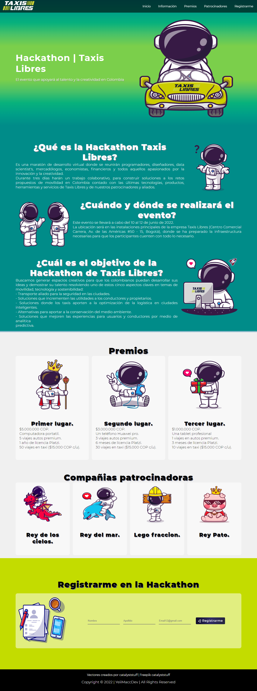
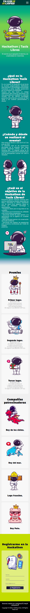

# LandingPage_TaxisLibres_Hackathon2022 
## HTML | CSS - Responsive | JavaScript

Este proyecto es creado con el fin de: 
-	participar en la oferta de empleo ofrecida por Taxis Libres a desarrollador web.
-	Poner en practica conocimientos sobre html, css y javascript.

Ver en:  https://yeiimacc-taxislibres-hackathon.netlify.app

## web version

## Mobile version

